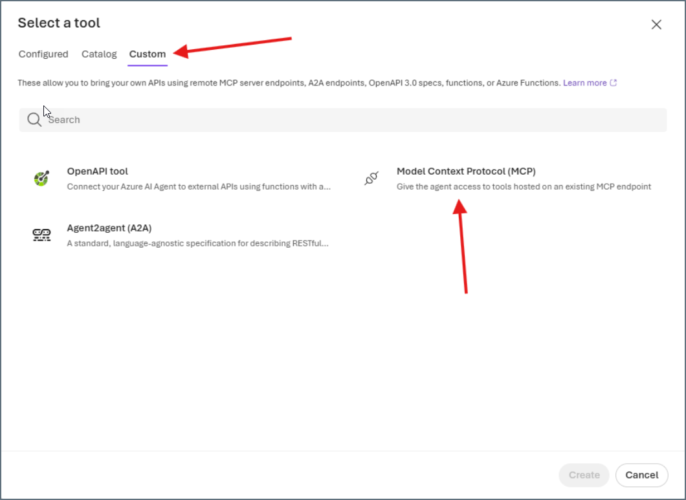

## Prerequisites

Before you can configure and use Microsoft Foundry with Connect AI, you must do the following: 

- Connect a data source to your Connect AI account if you have not done so already. See [Sources](/ja/Sources) for more information.

- Generate a Personal Access Token (PAT) on the [Settings](/ja/Settings#access-tokens) page. Copy this down, as it acts as your password during authentication.

- Base64 encode your Connect AI credentials in the following format: `Base64("email:PAT")`.

## Connect Microsoft Foundry to the Connect AI MCP  

<Steps>
<Step>
Create a project in Microsoft Foundry.

</Step>

<Step>
Click **Create Agent**.

<Frame>
  
</Frame>

</Step>

<Step>
Provide a name for your agent, and then click **Create**.

<Frame>
  
</Frame>
</Step>

<Step>
After naming your agent, click **Save**. Add instructions (optional). Under **Tools**, click **Add**.

<Frame>
  
</Frame>

</Step>

<Step>
In the **Select a tool** dialog, click the **Custom** tab, and then click **Model Context Protocol**.

<Frame>
  
</Frame>

</Step>

<Step>
In the **Add Model Context Protocol** dialog, enter the following:
- **Name**–the name of your MCP server, for example, *ConnectAIMCPServer*.
- **Remote MCP Server endpoint**–*https://mcp.cloud.cdata.com/mcp*.
- **Authentication**–select **Key-based**.
- **Credential**–enter *Basic*, followed by your *Base64-encoded email:PAT*.  

<Frame>
  
</Frame>
</Step>

<Step>
Click **Connect**. You should see the MCP server listed under **Tools**.
</Step>

<Step>
Click **Save** again to save your agent.
</Step>

<Step>
You can confirm your connection by clicking the **YAML** tab. You should see the following:

<Frame>
  
</Frame>

</Step>

<Step>
Click the **Chat** tab and ask the agent a question about your data. The agent shows the tools used to arrive at an answer.

<Frame>
  
</Frame>

</Step>
</Steps>