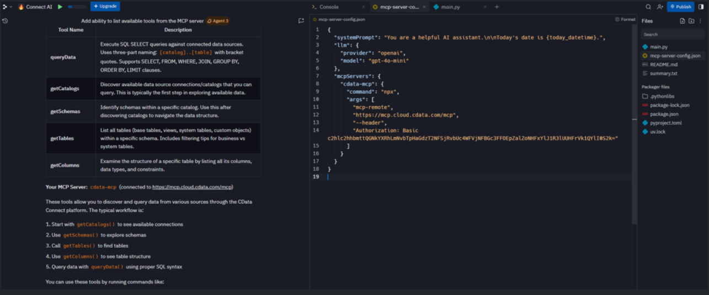

## Prerequisites

Before you can configure and use Replit with Connect AI, you must first do the following:

- Install the Replit IDE.

- Connect a data source to your Connect AI account. See [Sources](/ja/Sources) for more information.

- Generate an [OAuth JWT bearer token](/ja/API/Authentication-Embedded). Copy this down, as it acts as your password during authentication.

- Obtain an OpenAI API key: [https://platform.openai.com/](https://platform.openai.com/).

## Connect Replit to the Connect AI MCP

<Steps>
<Step>
Open the official Replit MCP learning template available [here](https://replit.com/@matt/Learn-about-MCP?v=1&utm_source=matt&utm_medium=blog&utm_campaign=mcp-in-3#README.md). This template includes a preconfigured MCP runtime environment and sample configuration.
</Step>

<Step>
In Replit, click **Remix**. Replit does the following:

- Creates a editable copy of the project.
- Installs MCP dependencies.
- Initializes the environment.

Wait for the environment to fully load before continuing.
</Step>

<Step>
Inside the project is a file named `mcp-server-config.json`. Copy and paste the following into this file. Replace the authorization header with the credentials obtained in the prerequisites.

```json
{
  "systemPrompt": "You are a helpful AI assistant.

Today's date is {today_datetime}.",
  "llm": {
    "provider": "openai",
    "model": "gpt-4o-mini"
  },
  "mcpServers": {
    "cdata-mcp": {
      "command": "npx",
      "args": [
        "mcp-remote",
        "https://mcp.cloud.cdata.com/mcp",
        "--header",
        "Authorization": "Basic Bearer OAUTH_JWT_TOKEN" //OAuth JWT Token
      ]
    }
  }
}
```
</Step>

<Step>
Replit requires an LLM key to run MCP workflows. In the **Replit Chat**, when asked for an LLM key, provide your OpenAI API key. Replit stores this key securely in the **Secrets Manager**.
</Step>

<Step>
You can now open the **Replit Chat** panel and issue MCP commands. 

For example, enter the prompt `"List all MCP tools."` The output looks like the following:
<Frame>
  
</Frame>
</Step>

<Step>
To test whether Replit can communicate with the CData MCP successfully, enter the prompt: `"Show me all available catalogs."` Replit should return a list of catalogs from Connect AI.
</Step>

<Step>
You can now query your connected data source(s) in Connect AI using the Replit's LLM.
</Step>
</Steps>

