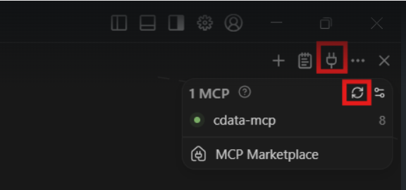

## Prerequisites

Before you can configure and use Windsurf with Embedded Cloud, you must first do the following:

- Install the Windsurf IDE (MCP integrations do not support extensions or plugins).

- Connect a data source to your Embedded Cloud account. See [Sources](/Sources) for more information.

- Generate an [OAuth JWT bearer token](/Authentication-Embedded). Copy this down, as it acts as your password during authentication.

## Connect Windsurf to the Embedded Cloud MCP

<Steps>
<Step>
Open Cascade Code Chat Assistant, either by pressing CTRL+L or by clicking the button highlighted below.
<Frame>
  
</Frame>
</Step>
<Step>
In Windsurf, open the MCP configuration file, `mcp_config.json`, which is created during installation. The default path is `C:\Users\<YourUsername>\.codeium\windsurf\mcpconfig.json`. You can also open it directly from the IDE by clicking the MCPs button in the chat dialog, and then selecting the **Config** icon, as shown below:
<Frame>
   
</Frame>
</Step>
<Step>
Copy and paste the following into the `mcp_config.json` file. Replace the authorization header with the credentials obtained in the prerequisites.

```json
{
  "mcpServers": {
    "cdata-mcp": {
      "serverUrl": "https://mcp.cloud.cdata.com/mcp",
      "headers": {
        "Authorization": "Bearer OAUTH_JWT_TOKEN" //Replace with your OAuth JWT Token
      }
    }
  }
}
```
</Step>
<Step>
Start the MCP server by clicking the **MCPs** button in the chat dialog and clicking the **Refresh** button. 
<Frame>
   
</Frame>
Once the MCP server is started, a green indicator appears.
</Step>
<Step>
You can now chat with the assistant. Windsurf lists the available tools, the connections, and a result set of a given table of a given connection.
<Frame>
   
</Frame>
</Step>
</Steps>

